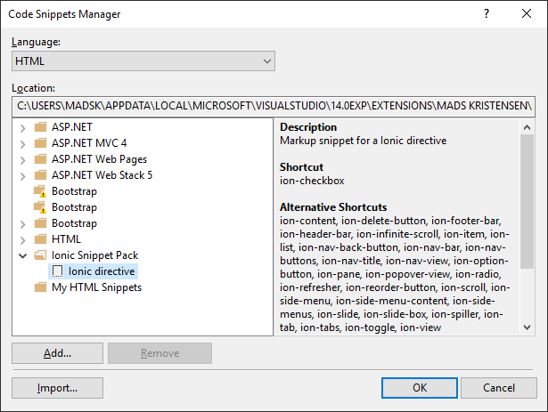

# Ionic Snippet Pack for Visual Studio

Download this extension from the
[VS Gallery](https://visualstudiogallery.msdn.microsoft.com/423eb4a3-215f-4a8f-9287-1512618ffda3)
or get the
[nightly build](http://vsixgallery.com/extension/dcf84938-593b-49d8-9dff-d6014632e44e/).

-----------------------------------------

A snippet pack to make you more productive working with
the Ionic Framework for Apache Cordova.

## Intellisense
It adds Intellisense for the Ionic directives in the HTML
editor.

This extension ships a bunch of useful code snippets for
the HTML editor. Get an overview from the
**Code Snippet Manager** in Visual Studio located under
the **Tools** top level menu.

