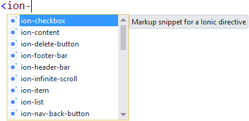
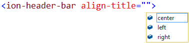
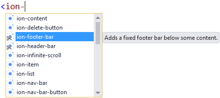
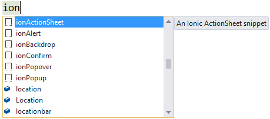

# Ionic Pack for Visual Studio

Download this extension from the
[VS Gallery](https://visualstudiogallery.msdn.microsoft.com/d6279fba-bcff-4857-906d-29faa8a99448)
or get the
[nightly build](http://vsixgallery.com/extension/dcf84938-593b-49d8-9dff-d6014632e44e/).

-----------------------------------------

A set of tools to make you more productive working with
the Ionic Framework for Apache Cordova.

See the [changelog](CHANGELOG.md) for changes and roadmap.

## HTML

### Intellisense
It adds Intellisense for the Ionic directives in the HTML
editor.

Also attribute and attribute values have Intellisense.

### Validation
The validation helps identify common mistakes and typos
directly in the editor, so you can quickly fix them
and move on.

### Snippets
Snippets makes it easy to scaffold markup components. They
appear in the regular HTML element Intellisenese and you
can easily identify them by their Ionic snippet icon.

## JavaScript
When wring JavaScript, the edtiing is beefed up to
give even better and more precise Intellisense and tooltips
for projects consuming _ionic.bundle.js_

### Intellisense
[Descriptions and screenshot coming soon...]

### Snipppets
Snippets makes it easy to scaffold scripted components. 
They appear in the regular JavaScript Intellisenese and
they all start with the word _ion_ followed by name.

